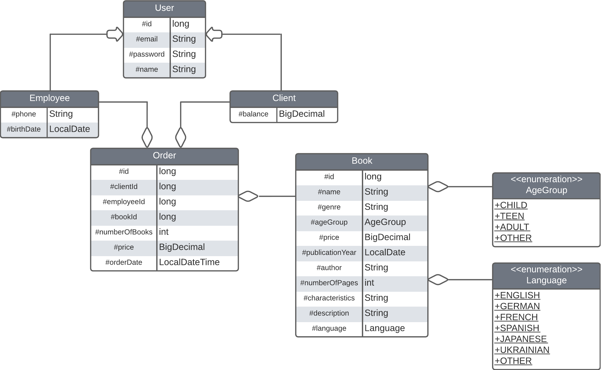

# Book Store. Lambdas and Streams

The purpose of this exercise is to check your knowledge of the Stream API and lambda expressions and your ability to use them to work with Java collections.  

Duration: **1** hour

## Description

In this exercise, you will implement "Book Store" to allow users to filter and sort books and information about orders in a variety of ways.
The class diagram of the Domain model is shown in the figure below: 



You are also given a description of the following interfaces and class:
* The `Sort` interface allows books to be sorted by published year, price(in descending order) and orders to be sorted by clientId.
* The `Find` interface allows users to search for and filter books and orders based on various criteria.
* The `Add` interface allows books and orders to be added.
* The `Store` class determines the functionality of the book store.

First, proceed to the Domain model classes and implement their content.

Then, proceed to the `Store` class, which contains lists of the `Book` class and the `Order` class, and also implements the `Sort`,`Find` and `Add` interfaces. You need to implement the following methods of the `Store` class:

* `public void addBook(Book book)`  
  Adds a book to the list of books

* `public void addOrder(Order order)`  
  Adds an order to the list of orders

* `Set<String> findAuthors()`  
  Returns a set of the authors in the store's fleet

* `Map<String, List<Order>> findOrdersGroupedByClientId()`  
  Returns a map in which the key is the clientId, and the value is a list of the orders of selected client that the store has in its fleet

* `List<String> findMostPopularAuthors()`  
  Calculates how much times each books of the author in the fleet has been ordered and then return the list of authors which has the greatest numbers of orders

* `List<Book> findBooksWhichPublishedAfterSelectedDate(LocalDate date)`  
  Returns a list of books which published date is after selected date

* `List<Book> findBooksInPriceRange(BigDecimal min, BigDecimal max)`  
  Returns a list of books which price within a range

* `Set<Client> findClientsWithAveragePriceNoLessThan(List<Client> clients, int average)`  
  Calculates the average number of orders for each client and returns a set of clients whose average order amount is not less than the average

* `Set<Order> findOrdersByDate(LocalDateTime dateTime)`  
  Returns a set of orders which has order date like selected

* `List<Book> sortOrdersByClientId()`  
  Returns all orders sorted by clientId as a new list

* `List<Book> sortBooksByPublishedYear()`  
  Returns all books sorted by _published year_ as a new list

* `List<Book> sortBooksByPriceDesc()`  
  Returns all books sorted by price as a new list in the descending order

> _Note_: When implementing the methods of the `Find` and `Sort` interfaces, you **must use** the Stream API and lambda expressions.

### Details
* Domain model classes must have the following:
    -	A default constructor
    -	A constructor that takes values to initialize all fields as parameters
    -	Getters and setters for all fields
    -	The `equals()`, `hashCode()`, and `toString()` methods 
>_Note_: In the future, it's expected that objects of these classes will be transferred over a network or stored in a file or database.  

*  The string representation of an object of these classes must follow the following convention:
    ```
    Class_name{field1_name=field_value,     field2_name=field_value, …}
    ```
    -	If a class inherits another class, it must include inherited fields before its own fields:
    ```
    Class_name{parent_class_fields, own_fields}
    ```
    - String values must be surrounded by apostrophes. For example: text='value' 
    -	If a field is a collection or an array, its value must be surrounded by square brackets.
    -	Fields must be ordered as denoted in the UML class diagram.

### An example of a string representation


Let class A have the following description:
```
class A {
    private int p = 10;
    protected int a = 1;
    protected String s = "a string";
    // ...
}
```
The string representation of the object will be as follows:
```
A{p=10, a=1, s='a string'}
```
Let class B be the inheritor of class A and have the following description:
```
class B extends A {
    private int b = 5;
    private String t = "a text";
    private char[] chars = {'a', 'b'};
    // ...
}
```

The string representation of the object will be as follows:
```
B{a=1, s='a string', b=5, t='a text', chars=[a, b]}
```
