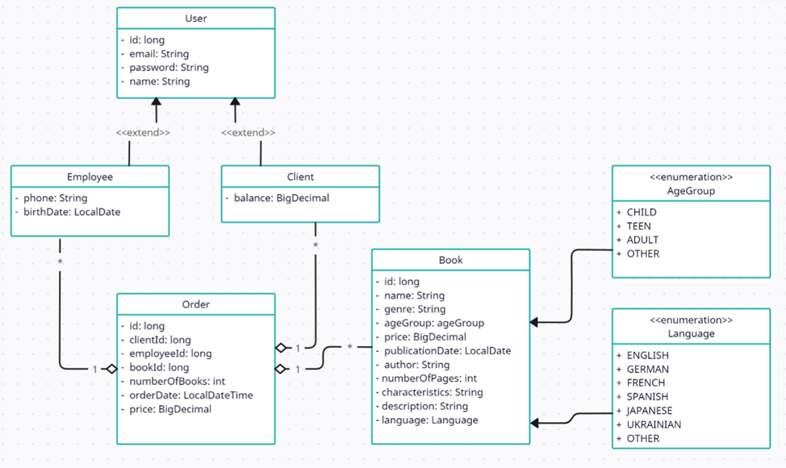

# Book Store. Lambdas and Streams

The purpose of this exercise is to check your knowledge of the Stream API and lambda expressions and your ability to use them to work with Java collections.  

Duration: **1** hour

## Description

In this exercise, you will implement "Book Store" to allow users to filter and sort books and information about orders in a variety of ways.
The class diagram of the Domain model is shown in the figure below:

You are also given a description of the following interfaces and class:
* The `Sort` interface allows books to be sorted by published year, price(in descending order) and orders to be sorted by clientId.
* The `Find` interface allows users to search for and filter books and orders based on various criteria.
* The `Add` interface allows books and orders to be added.
* The `Store` class defines the functionality of the book store.

First, proceed to the Domain model classes and implement their content.

Then, proceed to the `Store` class, which contains lists of the `Book` objects and the `Order` objects, and also implements the `Sort`,`Find` and `Add` interfaces. 
You need to implement the following methods of the `Store` class:

* `public void addBook(Book book)`  
   Adds a book to the list of books

* `public void addOrder(Order order)`  
   Adds an order to the list of orders

* `Set<String> findAuthors()`  
   Returns a set of the authors

* `Map<String, List<Order>> findOrdersGroupedByClientId()`  
   Returns a map in which the key is the clientId, and the value is a list of the orders of selected client that the store has

* `List<String> findMostPopularAuthors()`  
   Calculates the number of books that has been ordered for each author 

* `List<Book> findBooksWhichPublishedAfterSelectedDate(LocalDate date)`  
   Returns a list of books whose published date is after the date parameter

* `List<Book> findBooksInPriceRange(BigDecimal min, BigDecimal max)`  
   Returns a list of books whose price within a range provided by min and max parameters

* `Set<Client> findClientsWithAveragePriceNoLessThan(List<Client> clients, int average)`  
   Calculates the average number of orders for each client and returns a set of clients whose average order amount is not less than the average

* `Set<Order> findOrdersByDate(LocalDateTime dateTime)`  
  Returns a set of orders that has the same orderDate as the dateTime parameter

* `List<Book> sortOrdersByClientId()`  
  Returns all orders sorted by clientId as a new list

* `List<Book> sortBooksByPublishedYear()`  
  Returns all books sorted by year of publishing as a new list

* `List<Book> sortBooksByPriceDesc()`  
  Returns all books sorted by price as a new list in desc order

> _Note_: When implementing the methods of the `Find` and `Sort` interfaces, you **must use** the Stream API and lambda expressions.
